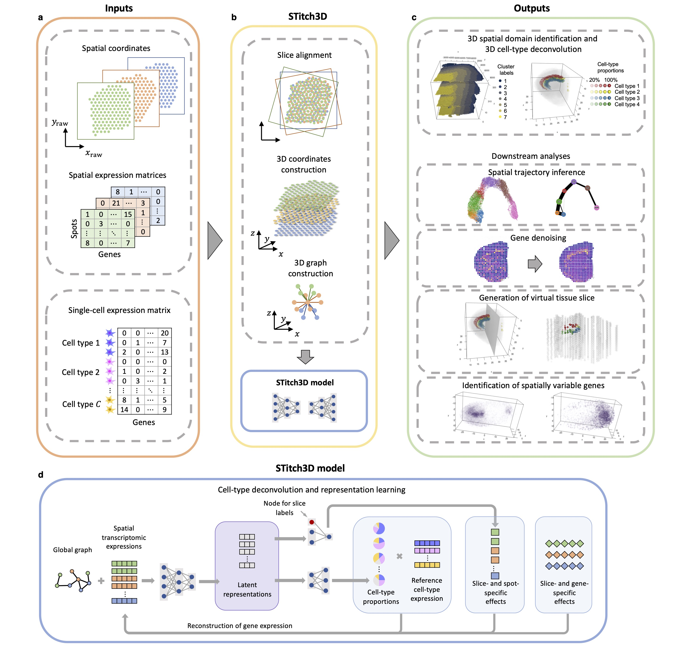
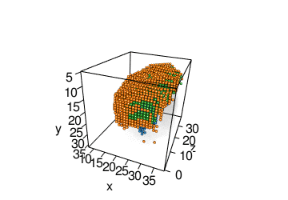

# STitch3D

### Construction of a 3D whole organism spatial atlas by joint modeling of multiple slices



We developed STitch3D, a deep learning-based method for 3D reconstruction of tissues or whole organisms. Briefly, STitch3D characterizes complex tissue architectures by borrowing information across multiple 2D tissue slices and integrates them with a paired single-cell RNA-sequencing atlas.

With innovations in model designs, STitch3D enables two critical 3D analyses: First, STitch3D detects 3D spatial tissue regions which are related to biological functions, for example cortex layer structures in brain; Second, STitch3D infers 3D spatial distributions of fine-grained cell types in tissues, substantially improving the spatial resolution of seq-based ST approaches. The output of STitch3D can be further used for various downstream tasks like inference of spatial trajectories, denoising of spatial gene expression patterns, identification of genes enriched in specific biologically meaningful regions and detection of cell type gradients in newly generated virtual slices.

An example: STitch3D reconstructed the adult mouse brain, detected 3D layer organizations of the cerebral cortex, and infered curve-shaped distributions of four hippocampal neuron types in three cornu ammonis areas and dentate gyrus.

 

Installation
------------
* STitch3D can be downloaded from GitHub:
```bash
git clone https://github.com/YangLabHKUST/STitch3D.git
cd STitch3D
conda env update --f environment.yml
conda activate stitch3d
```

Tutorials and reproducibility
-----------------------------
We provided codes for reproducing the experiments of the paper "Construction of a 3D whole organism spatial atlas by joint modeling of multiple slices", and comprehensive tutorials for using STitch3D. Please check the [tutorial website](https://stitch3d-tutorial.readthedocs.io/en/latest/index.html) for more details.

Interactive 3D results
----------------------
Interactive 3D analysis results from STitch3D are available at the [website](https://stitch3d-tutorial.readthedocs.io/en/latest/index.html).
